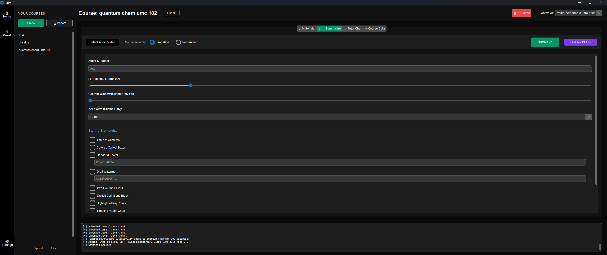
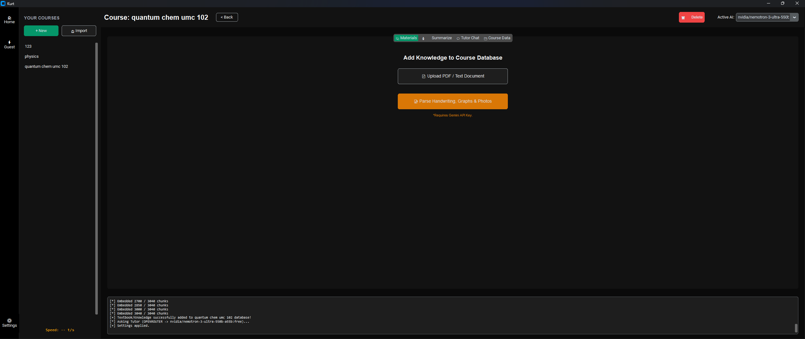
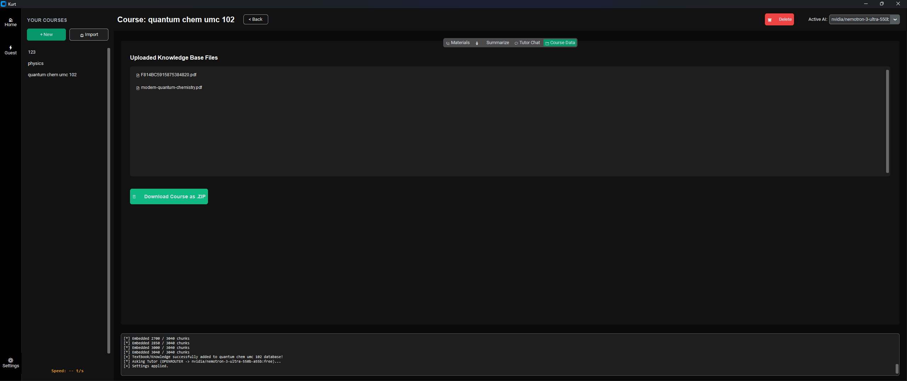
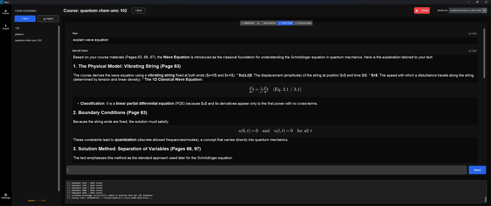
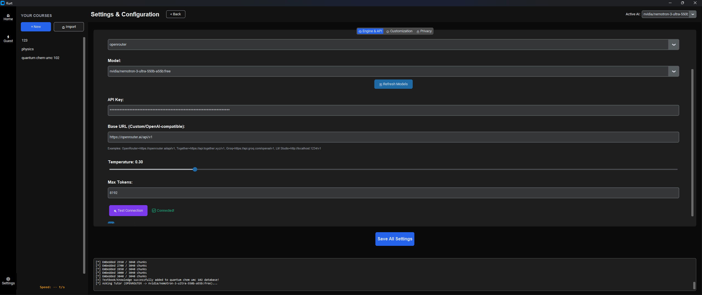
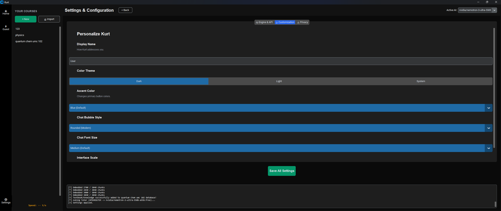

# Kurt: The Ultimate Offline-First AI Tutor & Meeting Summarizer

Welcome to **Kurt**! Kurt is a highly advanced, fully offline-capable, and privacy-first intelligent desktop assistant engineered to revolutionize how you study, work, and organize information. Built entirely in Python using `customtkinter` for a sleek, modern UI, Kurt seamlessly integrates state-of-the-art Natural Language Processing (NLP), local Speech-to-Text transcription, and advanced Retrieval-Augmented Generation (RAG) capabilities into a single, cohesive application.

Whether you need to transcribe a three-hour university lecture, generate an intricate LaTeX summary of your meeting notes, or chat interactively with hundreds of uploaded PDFs, Kurt is designed to handle it all—while keeping your personal data completely private and local.

---

## 🌟 Why Kurt is in a League of Its Own

Modern AI applications often rely on cloud infrastructure, sacrificing user privacy, internet bandwidth, and local control. Kurt solves this by bringing the power of modern AI directly to your local machine.

- **Privacy-First & Fully Local Architecture:** Kurt is designed from the ground up to run entirely offline. By leveraging local Large Language Models (LLMs) via **Ollama** and local speech recognition via **Whisper**, your highly sensitive meeting audios and personal documents never leave your computer unless you explicitly decide to connect a cloud provider.
- **State-of-the-Art RAG Pipeline:** Kurt isn't just a simple chatbot wrapper. It features a sophisticated localized vector database (ChromaDB) backed by HuggingFace embeddings (`sentence-transformers`). It chunks, embeds, and intelligently searches your specific documents to ground the AI's answers in reality, significantly reducing hallucination.
- **Offline Math & True Markdown Rendering:** Unlike web-based chatbots that rely on MathJax and JavaScript, Kurt features a custom, offline `matplotlib`-powered LaTeX rendering engine built natively into the Tkinter UI. It perfectly renders complex, multi-line mathematical equations, combined with true HTML Markdown support for headers, bold text, and lists.
- **Automated LaTeX PDF Compilation:** Kurt doesn't just give you raw text. It automatically synthesizes meeting summaries, action items, and academic notes into beautifully formatted LaTeX documents and compiles them directly into PDFs using the lightweight Tectonic engine.
- **Multi-Modal Capabilities:** Kurt seamlessly merges audio processing, document ingestion, optical character recognition (via Gemini Vision), and text generation into one unified workflow.

---

## 💻 Comprehensive System Requirements

Running local AI requires adequate hardware. Below are the requirements to ensure Kurt runs smoothly.

### Minimum Requirements (Cloud AI Mode)
If you intend to use Cloud APIs (like Google Gemini or OpenAI) for text generation, you only need enough power to run the GUI and basic local embeddings:
- **OS:** Windows 10/11, macOS, or Linux
- **Processor (CPU):** Quad-core Intel or AMD processor (e.g., Intel Core i5 / AMD Ryzen 5)
- **RAM:** 8 GB DDR4
- **Storage:** 2 GB of free space for local application dependencies and ChromaDB databases.
- **Python:** Version 3.8 to 3.11

### Recommended Requirements (Fully Local Offline Mode)
To run local 7B or 8B parameter LLMs (like Llama-3 or Mistral) and process fast local transcriptions:
- **Processor (CPU):** 8-core modern processor (Intel Core i7/i9 or AMD Ryzen 7/9)
- **RAM:** 16 GB to 32 GB DDR4/DDR5
- **GPU (Highly Recommended):** Dedicated NVIDIA GPU with at least 8GB of VRAM (e.g., RTX 3060, RTX 4070 or better). CUDA support is critical for hardware-accelerated transcription using `faster-whisper`.
- **Storage:** NVMe SSD for fast vector database retrieval and model weight loading.

---

## 🚀 How to Install and Run Kurt

Follow these steps to deploy Kurt locally on your machine.

### 1. Clone the Repository & Prepare the Environment
Ensure you have Python installed. It is highly recommended to use a virtual environment (like Anaconda or `venv`) to prevent dependency conflicts.
```bash
git clone https://github.com/your-username/kurt-summarizer.git
cd kurt-summarizer
```

### 2. Install the Required Dependencies
Kurt relies on several powerful AI libraries, including `torch`, `langchain`, `chromadb`, and `faster-whisper`. Install them by running:
```bash
pip install -r requirements.txt
```
*Note: If you plan to use NVIDIA GPU acceleration, ensure you have the appropriate PyTorch CUDA build installed.*

### 3. Install Ollama (Optional, for Local LLMs)
If you want to use offline LLMs:
1. Download and install [Ollama](https://ollama.com/).
2. Pull a local model by running `ollama run llama3` in your terminal.

### 4. Setup Tectonic (For PDF Compilation)
Kurt uses Tectonic to compile LaTeX documents without requiring a massive, multi-gigabyte TeXLive installation.
1. Download the Tectonic executable for your OS from the [Tectonic releases page](https://tectonic-typesetting.github.io/).
2. Place the executable (`tectonic.exe` on Windows) inside an `engines/` directory at the root of the Kurt project.

### 5. Launch the Application
Once the dependencies are installed and the environment is prepped, simply run:
```bash
python main.py
```

---

## 🧠 Deep Dive: Architecture & Demo Walkthrough

Kurt's interface is divided into several powerful modules. Let's walk through each one, explaining the underlying AI architecture that makes it work.

### 1. Audio Transcription & Synthesis


**How it works:**
The transcription engine is powered by **Faster-Whisper**, a highly optimized reimplementation of OpenAI's Whisper model using CTranslate2. 
- When you upload an audio file, Kurt's `MeetingTranscriber` processes it locally. It uses Voice Activity Detection (VAD) to skip silent parts, dramatically speeding up the process. 
- It is capable of locking onto the GPU via CUDA to achieve transcription speeds that are often 10x to 20x faster than real-time audio playback.
- Once transcribed, the raw text is passed to your selected LLM (Local or Cloud). The LLM is given strict system prompts to extract key action items, summarize main arguments, and format the output into clean, structured LaTeX.
- Finally, Tectonic steps in to compile this LaTeX output into a beautifully formatted, shareable PDF.

### 2. The RAG Ingestion Pipeline


**How it works:**
Basic LLMs have a knowledge cutoff and know nothing about your private course materials. Kurt solves this using a **Retrieval-Augmented Generation (RAG)** pipeline.
- **Document Parsing:** When you upload a PDF or text file, Kurt uses `PyMuPDF` and `Langchain` to extract the raw text.
- **Text Splitting:** The document is systematically broken down into smaller, overlapping semantic chunks (e.g., 1000 characters per chunk). This ensures no context is lost across page breaks.
- **Vector Embeddings:** Each chunk is passed through a local HuggingFace embedding model (`sentence-transformers/all-MiniLM-L6-v2`). This model converts human-readable text into high-dimensional numerical vectors, mapping the semantic meaning of the text.
- **ChromaDB Storage:** These vectors are saved directly to your hard drive inside a local Chroma vector database, organized by course. This process happens entirely offline and is incredibly fast.

### 3. Course Data Management


**How it works:**
This interface acts as the central hub for your customized knowledge bases. 
- Every course gets its own dedicated partition in the `vector_db` folder.
- You can manage exactly what files are feeding the AI's brain. If a course changes, simply delete the old files and ingest new ones. 
- The RAG engine dynamically updates the vector collections in real-time, meaning the AI is always operating with the most up-to-date context.

### 4. Interactive AI Tutor Chat (With Local Math Rendering)


**How it works:**
The Tutor Chat is where the RAG pipeline comes alive. 
- **Retrieval:** When you ask a question (e.g., "Explain the wave equation"), Kurt converts your question into a vector using the exact same embedding model used during ingestion. It then queries the Chroma database to find the top 5 most semantically similar chunks of text from your uploaded documents.
- **Augmentation:** These chunks are injected invisibly into the AI's system prompt as "contextual ground truth." The AI is instructed to answer your question *strictly* based on this retrieved context, heavily reducing hallucinations.
- **Offline UI Rendering:** GUI frameworks like Tkinter generally struggle with HTML and Markdown. Kurt implements a highly custom rendering pipeline. It parses the LLM output, strips out raw markdown, and passes it through an HTML engine (`tkhtmlview`) for native bold and heading support. 
- **Matplotlib Equations:** For complex multi-line math equations, Kurt intercepts LaTeX math blocks (like `$$` or `\[`), splits them, and uses the `matplotlib` mathematical typesetting engine to generate transparent PNG images natively in the background. These images are then seamlessly embedded inline with the text!

### 5. LLM Provider Flexibility


**How it works:**
Kurt isn't locked into a single ecosystem. 
- The **Settings Engine** allows you to seamlessly hotswap between different AI providers on the fly.
- Select **Ollama** to run models completely locally and privately.
- Switch to **OpenRouter**, **Anthropic**, **OpenAI**, or **Google Gemini** by simply pasting your API key. The UI dynamically reconfigures its input fields based on the chosen provider architecture, ensuring maximum compatibility for any future LLMs.

### 6. Extensive UI Customization


**How it works:**
Built on top of `customtkinter`, the application is highly responsive and aesthetically pleasing.
- Users can adjust chat bubble sizes, font scaling, UI scaling, and toggle between Light and Dark modes.
- The UI is designed to reduce eye strain during long study or review sessions, mimicking modern dark-mode applications like VS Code and Discord.

---

## 🔒 A Note on Privacy and Security

In an era where data is constantly being scraped, Kurt puts control back in your hands. 
By utilizing the offline Whisper transcription engine, local embedding generation, and Ollama, **you do not need an internet connection to use the core features of Kurt.** Sensitive corporate meetings, private university lectures, and unreleased academic papers can be processed, summarized, and queried without a single byte of data ever leaving your local hardware. 

---

